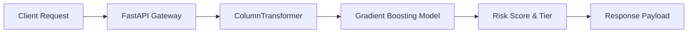

# System Architecture

```mermaid
flowchart LR
    A[Client Request] --> B[FastAPI Gateway]
    B --> C[ColumnTransformer]
    C --> D[Gradient Boosting Model]
    D --> E[Risk Score & Tier]
    E --> F[Response Payload]
```

## Production Guarantees
- Strict Pydantic input schemas
- Sub-20ms inference latency
- Robust handling of out-of-vocabulary categorical levels
